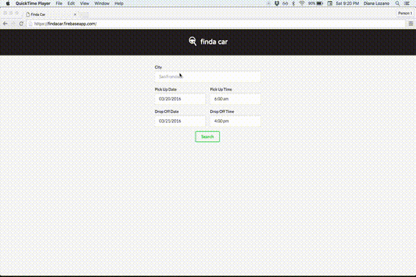

# finda car

**finda car** is a single page app that lets a user find a rental car by date, time and location. It shows the user a list of cars available through [Hotwire's Rental Car Shopping API](http://developer.hotwire.com/docs/Rental_Car_Shopping_API). This app is built in React and most of the styled elements come from [Semantic-UI](http://semantic-ui.com/).

Read more about it [here](http://cutofmyjib.github.io/finda-car.html).

### Run the app locally
1. Clone the repo
2. `cd react-starter-master`
2. `npm install`
3. `npm start`
4. Navigate to http://localhost:8080/

